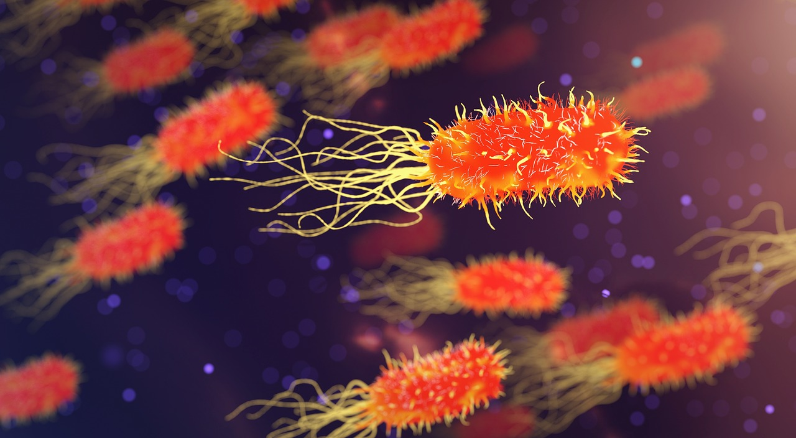

# A Belly Button Biodiversity Analysis 

## Authors
* Daniel Cespedes - [LinkedIn](https://www.linkedin.com/in/selinzorob/) - [GitHub](https://github.com/danielczz)




## Project Outline
 
In this project we are going to analyze sample data from our Belly Buttons and build a web application in order to share insights about our main topic today:

 **Belly Buton Biodiversity Analysis**

 - The _**Belly Button**_ in our body is like a jungle of bacteria.
 - Researchers believe that understanding this microbes world is useful to improve our health status and also our lives.
- Detailed info about the analysis: [_What Lives in Your Belly..._](https://news.nationalgeographic.com/news/2012/11/121114-belly-button-bacteria-science-health-dunn/)
- Access to final live application: 
[_Deployed Heroku Flask application_](https://belly-button-biodiversity-dscz.herokuapp.com/)


## Technology Landscape

1. JavaScript, one of the core technologies of the World Wide Web.
[_JavaScript_](https://www.javascript.com/)

1. HTML - _Hypertext Markup Language_ is the standard markup language for creating web pages and web applications.
[_HTML_](https://www.w3.org/html/)

1. Heroku - Heroku is a cloud platform as a service (PaaS) supporting several programming languages for deployment.
[_Heroku_](https://www.heroku.com/)

1. Flask - Flask is a micro web framework written in Python. 
[_Flask_](http://flask.pocoo.org/)


1. D3.js - _Data Driven Document for JavaScript_ is a JavaScript library for producing dynamic, interactive data visualizations in web browsers.
[_D3.js_](https://d3js.org/)

1. DOM - _The Document Object Model_ is an application programming interface (API) for HTML and XML documents.
[_DOM_](https://www.w3.org/TR/DOM-Level-1/introduction.html)


## Data Analysis Framework

This is a brief sample extraction of the JavaScript code. Find the complete code available here: [_app.js_](static/js/app.js)

### **Data gathering**
- Data provided for the analysis on SQL.


### **Data analysis**

#### Step 1 - Plotly.js
1. To create a PIE chart that uses data from your samples route (`/samples/<sample>`) to display the top 10 samples.


1. To create a Bubble Chart that uses data from samples route (`/samples/<sample>`) to display each sample.

#### Step 2 - Heroku
Deploy your Flask app to Heroku.


#### ***Building table metadata**
```JS
function buildMetadata(sample) {
    // The following function that builds the metadata panel
    // Use d3 to select the panel with id of `#sample-metadata`
    url_Metadata = "/metadata/" + sample;    

    var Panel = d3.select("#sample-metadata");
    // Use `.html("") to clear any existing metadata
    Panel.html("");

    // Use `d3.json` to fetch the metadata for a sample
    d3.json(url_Metadata).then((sample_Metadata) => {
      Object.entries(sample_Metadata).forEach(([key, value]) => {       
        //  Lets create a row per content in the sample_Metadata
        var row = Panel.append("h6");       
        //  Lets create the content that goes on the row (With non-breaking spaces)
        var content = key+':'+'\xa0'+value;       
        row.text(content);
      });
    });

}
```

#### ***Building charts - Step 1 - Pie Chart**
```JS
function buildCharts(sample) {

  // Pie Chart

  var datajson = d3.json("/samples/"+ sample);

  var newlist = [];

  datajson.then((data) => {
     
    var reference = data;

    for (i = 0; i < data.otu_ids.length; i++) { 
      newlist.push({
        otu_ids: data.otu_ids[i], 
        sample_values: data.sample_values[i], 
        otu_labels: data.otu_labels[i], 
      });
    };

    newlist.sort((a,b) => b.sample_values - a.sample_values);
    var piedata = Object.entries(newlist).slice(0,10).map(entry => entry[1]);

// Use sample_values as the values for the PIE chart
// Use otu_ids as the labels for the pie chart
// Use otu_labels as the hovertext for the chart

    var final_ids = [];
    var final_values = [];
    var final_labels = [];

    // console.log(final_ids);

    for (j=0; j<10; j++){
      final_ids.push(piedata[j].otu_ids);
      final_values.push(piedata[j].sample_values);
      final_labels.push(piedata[j].otu_labels);
    };

    var data = [{
      values: final_values,
      labels: final_ids,
      hovertext: final_labels,
      showlegend: false,
      hoverinfo: "label+text+value+percent",
      textinfo: "percent",
      type: "pie"
    }];
  
    var layout = {
      height: 350,
      width: 900,
      margin: {
        l: 10,
        r: 10,
        b: 10, 
        t: 10,
        pad: 5
      }
    };
  
    Plotly.plot("pie", data, layout);   
    console.log(reference.otu_ids);
    console.log(reference.sample_values);
    console.log(reference.otu_labels);

...
```

#### ***Building charts - Step 2 - Bubble Chart**
```JS
...
      // Bubble Chart
  //Build a Bubble Chart using the sample data      
  trace = {
    x: reference.otu_ids,
    y: reference.sample_values,
    mode: "markers",
    name: reference.otu_labels,
    text: reference.otu_labels,
    marker: {
      size: reference.sample_values,
      color: reference.otu_ids,
    }              
  };

    var data = [trace];

    var layout = {
      title: "Belly Button Biodiversity Analysis",
      showlegend: false,
      xaxis: {title:"IDs",},
      yaxis: {title:"Sample Values"},
    }

    Plotly.newPlot("bubble", data, layout);

    return piedata;

  });

};
```

### **Data sharing**
- Here is a link for the final webpage application:
[_Deployed Heroku Flask application_](https://belly-button-biodiversity-dscz.herokuapp.com/) 

- Screencapture of the final running application: 

